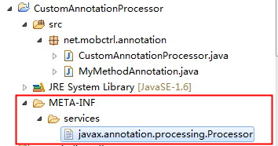
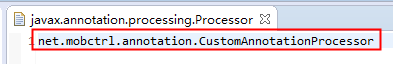
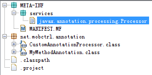
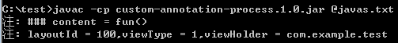

----------

##Java使用Annotation Processor获取代码中的Annotation
使用Java的Annotation Processing Tool (apt)可以在编译期获取Java代码文件中的Annotation。

----------

###Annotation的定义
如下，定义了一个MyMethodAnnotation
<code>

    @Retention(RetentionPolicy.CLASS)
    @Target(ElementType.METHOD)
    public @interface MyMethodAnnotation {
        int layoutId() default 0;
        int viewType() default 0;
        String viewHolder();
    }
</code>
使用关键字**@interface**定义了MyMethodAnnotation，它可以保存三个值。注意，Annotation的属性
####1.Retention
编译时处理的注解，它的类型是RetentionPolicy.CLASS；Retention的保留类型还有另外两种，RetentionPolicy.SOURCE和RetentionPolicy.RUNTIME。
####2.Target
注解使用的目标，ElementType.METHOD表示这个注解是使用在方法上的。除了方法之外，还包括使用在成员变量上的ElementType.FIELD类型以及使用在类、接口上的ElementType.TYPE类型。

----------

###Annotation的处理AbstractProcessor
我们可以写一个自己的AnnotationProcessor，继承自AbstractProcessor，然后导出Jar包，并在Jar包的META-INF中的services目录指定相应的处理类即可。具体做法为：
####实现自己的AbstractProcessor
<code>

	public class CustomAnnotationProcessor extends AbstractProcessor {

	
	private Set<String> supportedAnnotationTypes = new HashSet<String>();

	@Override
	public synchronized void init(ProcessingEnvironment processingEnv) {
		super.init(processingEnv);
		supportedAnnotationTypes.add(MyMethodAnnotation.class
				.getCanonicalName());
	}

	@Override
	public boolean process(Set<? extends TypeElement> annotations,
			RoundEnvironment roundEnv) {
		Messager messager = processingEnv.getMessager();
		for (TypeElement typeElement : annotations) {
			for (Element element : roundEnv
					.getElementsAnnotatedWith(typeElement)) {
				String info = "### content = " + element.toString();
				messager.printMessage(Kind.NOTE, info);
				//获取Annotation
				MyMethodAnnotation myMethodAnnotation = element
						.getAnnotation(MyMethodAnnotation.class);

				if (myMethodAnnotation != null) {
					int layoutId = myMethodAnnotation.layoutId();
					int viewType = myMethodAnnotation.viewType();
					String viewHolder = myMethodAnnotation.viewHolder();
					messager.printMessage(Kind.NOTE, "layoutId = " + layoutId
							+ ",viewType = " + viewType + ",viewHolder = "
							+ viewHolder);
				}

			}
		}
		return false;
	}

	@Override
	public SourceVersion getSupportedSourceVersion() {
		return SourceVersion.latestSupported();
	}

	@Override
	public Set<String> getSupportedAnnotationTypes() {
		return supportedAnnotationTypes;
	}

    }
</code>
主要需要关注的点：
#####getSupportedAnnotationTypes方法
把需要处理的Annotation的类名，保存到一个Set<String>中，然后返回。如果不指定对应的Annotation列表，那么process方法中将处理不到任何的Annotation。
#####process方法
在这里处理支持的Annotation类型。处理逻辑是：遍历所有的TypeElement的类型，然后再遍历每一个Element，然后再获得element的注解，把注解中注入的值打印出来。

----------
####Jar包的导出
Java项目的目录如下： 
 
需要在javax.annotaion.processing.Processor文件中指定对应的处理入口，比如： 
 
我们使用Eclipse将其导出成custom-annotation-process.1.0.jar包。导出之后的Jar包，反编译之后的结构为： 
 

----------
####编译时获取Annotation 
比如，我们需要编译如下代码：
<code>

	public class HelloMain {
	
	  @MyMethodAnnotation(layoutId = 100,viewType = 1,viewHolder = "com.example.test")
	  public void fun(){
		
	  }
    }
</code>
根据之前我们写的CustomAnnotationProcessor可知，我们可以获取fun方法的注解，并能够将注解内的值取出。
使用javac命令，-cp参数，对上述的HelloMain.java进行编译处理。在windows的cmd下的命令如下：
<code>

    dir /s /B *.java > javas.txt
	javac -cp custom-annotation-process.1.0.jar @javas.txt
</code>
首先将Java文件的路径写入到javas.txt文件中，然后使用javac编译文件。在cmd中打印结果如下： 

当然，除了直接使用javac命令之外，在Eclipse、Maven中也可以配置。在此，不在赘述。

###参考 
[1] [Annotation Processor配置](https://deors.wordpress.com/2011/10/08/annotation-processors/) 
[2] [Annotation实战](http://www.cnblogs.com/avenwu/p/4173899.html)

